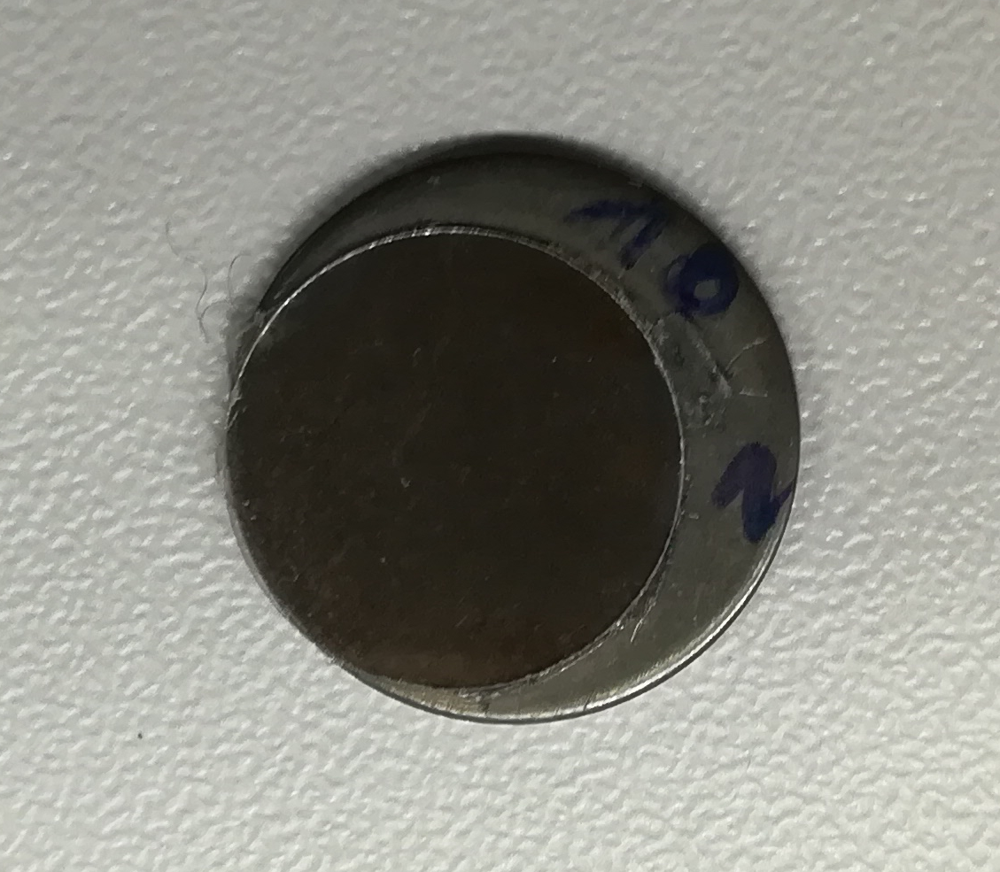

```{r, echo=FALSE,message=FALSE,warning=FALSE}
library(dplyr)
library(readODS)
library(reshape2)
library(ggplot2)
library(ggbeeswarm)
library(tidyverse)
library(DT)
library(reshape2)

peptydy <- read.csv("amyloid_heatmap.csv")
peptydy <- peptydy[1:(nrow(peptydy)-1),]
peptydy <- peptydy %>% mutate(match = ifelse(peptydy[["AmyLoad"]] == peptydy[["ThT"]], "yes", "no"))

peptydy <- peptydy %>% gather("method", "result", 2:4)

pep_order <- filter(peptydy, method == "AmyLoad") %>% arrange(result) %>%  pull(peptide) %>% as.character

peptydy[["peptide"]] <- factor(peptydy[["peptide"]], levels = pep_order)

peptydy_plot <- ggplot(peptydy, aes(x = method, y = peptide, fill = result)) +
  geom_tile() +
  geom_tile(aes(fill = result), color = "white") +
  # scale_fill_manual(values=c("red", "lightgreen")) +
  scale_x_discrete(limits=c("AmyLoad","ThT","match")) +
  theme_bw() +
  theme(text = element_text(size=9))


marlena <- read.csv("amyloid_heatmap_Marlena.csv")
marlena <- marlena[1:(nrow(marlena)-1),] %>% 
  gather("method", "result", 2:5)

pep_order_m <- filter(marlena, method == "AmyLoad") %>% arrange(result) %>%  pull(peptide) %>% as.character

marlena[["peptide"]] <- factor(marlena[["peptide"]], levels = pep_order_m)

marlena_plot <- ggplot(marlena, aes(x = method, y = peptide, fill = result)) +
  geom_tile() +
  geom_tile(aes(fill = result), color = "white") +
  # scale_fill_manual(values=c("red", "lightgreen")) +
  scale_x_discrete(limits=c("AmyLoad","ThT", "Marlena", "Vytautas")) +
  theme_bw() +
  theme(text = element_text(size=9))


peptydy_intensity <- read.csv("amyloid_repeats.csv") %>% gather("day_rep", "intensity", 2:16) %>% 
  mutate(day = sapply(strsplit(day_rep, split = "_"), first),
         rep = sapply(strsplit(day_rep, split = "_"), last),
         day = gsub(pattern = "X", replacement = "", x = day)) 

peptydy_intensity_aggr <- group_by(peptydy_intensity, peptides,  day) %>% 
  summarise(intensity = median(intensity))


peptydy_intensity_plot <- ggplot(peptydy_intensity, aes(x = day, y = intensity, color = rep)) +
  geom_point() +
  facet_wrap(~ peptides, scales = "free_y") +
  theme_bw() +
  xlab("Dzień") +
  ylab("Intensywność") +
  scale_fill_manual(name = "Powtórzenie") +
  theme(text = element_text(size=4))

  
# M_plot <- pp2 %>% ggplot(aes(x=peptides, y=intensity, fill=day)) +
#   geom_col(position = "dodge") +
#   theme_bw() +
#   theme(axis.text.x = element_text(angle = 90, hjust = 1))
  

wzorzec <- read.csv("VU_10_peptides.csv")
wzorzec <- wzorzec %>% gather("method", "result", 2:5)

pep_order_10 <- filter(wzorzec, method == "AmyLoad") %>% arrange(result) %>%  pull(Peptyd) %>% as.character

wzorzec[["Peptyd"]] <- factor(wzorzec[["Peptyd"]], levels = pep_order_10)

plot_wzorzec <- ggplot(wzorzec, aes(x = method, y = Peptyd, fill = result)) +
  geom_tile() +
  geom_tile(aes(fill = result), color = "white") +
  # scale_fill_manual(values=c("red", "lightgreen")) +
  scale_x_discrete(limits=c("AmyLoad","Marlena", "Vytautas")) +
  theme_bw() +
  theme(text = element_text(size=5))


intensity_plot <- inner_join(peptydy_intensity_aggr, peptydy, by=c("peptides" = "peptide")) %>% 
  filter(method %in% c("AmyLoad", "ThT")) %>% 
  dcast(peptides + day + intensity~ method) %>% 
  group_by(peptides) %>% 
  mutate(norm_intensity = intensity / max(intensity)) %>% 
  ggplot(aes(x=peptides, y=norm_intensity, fill=day)) +
  geom_col(position = "dodge") +
  theme_bw() +
  facet_wrap(~ AmyLoad + ThT, scales = "free", labeller = label_both) +
  theme(text = element_text(size=4)) +
  theme(axis.text.x = element_text(angle = 90, hjust = 1, size = 3))
  
```


## Overview

Created: 2018-11-28.

Parsed: `r Sys.Date()`.

## Amyloidy

<style>

.column-left1{
  float: left;
  width: 45%;
  text-align: left;
}

.column-right1{
  float: right;
  width: 55%;
  text-align: right;
}
img {
    width: auto;
    height: auto;
    object-fit: cover;
}
.fill {object-fit: fill;}
.contain {object-fit: contain;}
.cover {object-fit: cover;}
.scale-down {object-fit: scale-down;}
.none {object-fit: none;}
</style>

<div class="column-left1">
- skupiska białek lub peptydów, które uległy nieprawidłowemu sfałdowaniu

- zbudowane głównie ze struktur β

- włókna amyloidowe są nierozpuszczalne i wysoce odporne na degradację

- skłonność peptydu do tworzenia amyloidu zależy od kilku czynników, takich jak sekwencja czy hydrofobowość
</div>

<div class="column-right1">


Agregaty amyloidowe blokujące komunikację między komórkami w chorobie Alzheimera
</div>

<!-- ## Alzheimer -->

<!-- 

## Niektóre choroby wywołane przez niefunkcjonalne amyloidy

- choroba Alzheimera

- choroba Parkinsona

- cukrzyca typu II

- choroba Creutzfeldta-Jakoba

- choroba Huntingtona

- amyloidoza

- katarakta

## Amyloidy funkcjonalne

- występują w wielu systemach biologicznych

- wykryte w bakteriach, grzybach, insektach oraz ssakach

Funkcje:

- przekazywanie sygnałów

- antytmikrobiologiczne

- strukturalne


## Curli

- system curli występuje w bakteriach z rodziny Enterobacteriace

- system curli jest najlepiej poznanym systemem pozakomórkowych funkcjonalnych amyloidów

- curli jest podstawowym białkowym składnikiem strukturalnym biofilmów

- curli to funkcjonalne nanowłókna amyloidowe

- system curli składa się z dwóch niezależnych operonów: csgBAC i csgDEFG

- włókna mogą stanowić 10-40% całkowitej objętości biowłókien biofilmu


## operon csgBAC i csgDEFG
<style>

.column-left1{
  float: left;
  width: 40%;
  text-align: left;
}

.column-right1{
  float: right;
  width: 60%;
  text-align: right;
}
img {
    width: auto;
    height: auto;
    object-fit: cover;
}
.fill {object-fit: fill;}
.contain {object-fit: contain;}
.cover {object-fit: cover;}
.scale-down {object-fit: scale-down;}
.none {object-fit: none;}
</style>

<div class="column-right1">
CsgA - duża podjednostka curli

CsgB - mała podjednostka curli, nukleator  

CsgC - inhibitor csgA     

CsgD - główny regulator wzrostu biofilmów

CsgE - peryplazmatyczne białko pomocnicze, kieruje do csgG 

CsgF - białko pomocnicze ułatwiające csgB adhezję do powierzchnii komórki

CsgG - białko transportujące csgA na zewnątrz komórki
</div>

<div class="column-left1">

</div>

<!-- ## operon csgBAC i csgDEFG -->

<!--  -->

## Cel badań

Celem pracy jest poznanie motywów odpowiedzialnych za agregację białka csgA.

Badania przeprowadzane są na peptydach celem wytrenowania algorytmu przewidującego amyloidogenność oraz ze względu na wysokie koszty produkcji całego białka.

Różne warianty białka csgA do późniejszych badań będą produkowane przez zespół prof. Schieracka.

## Cel pracy

Sprawdzenie poprawności predykcji poprzez analizę sekwencji zdeponowanych w bazie AmyLoad.

Wybrane zostały 24 peptydy, które miały najniższy lub najwyższy wynik. 13 pozytywnych oraz 11 negatywnych.

Badania mają na celu kalibrację algorytmu AmyloGramu.

## Sposób wybrania 24 peptydów

- z bazy AmyLoad pobraliśmy wszystkie sekwencje

- zbiór został podzielony na 2 grupy

- sprawdziliśmy czy sekwencje nie powtarzają się w obu grupach

- sekwencje przekształciliśmy przy wykorzystaniu zredukowanych alfabetów

- usuneliśmy duplikaty

- policzyliśmy wartości predykcji

## Metody

Do sprawdzenia właściwości amyloidogennych użyliśmy metody ThT.

W późniejszych etapach użyty zostanie FTIR oraz AFM.

Peptydy podczas syntezy de novo mogły zagregować. Do zaburzenia struktury III-rzędowej powszechnie stosowany jest NaOH.

## ThT

- ThT jest naładowany dodatnio

- wiązania elektrostatyczne z ujemnie naładowymi resztami

- zmiana intensywności jest zależna od ilości miejsc wiążących ThT a nie stężenia włókien

## FTIR


## FTIR derywatywy


## AFM

<style>

.column-left1{
  float: left;
  width: 48%;
  text-align: left;
}

.column-right1{
  float: right;
  width: 48%;
  text-align: right;
}
img {
    width: auto;
    height: auto;
    object-fit: cover;
}
.fill {object-fit: fill;}
.contain {object-fit: contain;}
.cover {object-fit: cover;}
.scale-down {object-fit: scale-down;}
.none {object-fit: none;}
</style>

<div class="column-left1">

</div>

<div class="column-right1">


</div>

## AFM

<style>

.column-left1{
  float: left;
  width: 48%;
  text-align: left;
}

.column-right1{
  float: right;
  width: 48%;
  text-align: right;
}
img {
    width: auto;
    height: auto;
    object-fit: cover;
}
.fill {object-fit: fill;}
.contain {object-fit: contain;}
.cover {object-fit: cover;}
.scale-down {object-fit: scale-down;}
.none {object-fit: none;}
</style>

<div class="column-left1">

</div>

<div class="column-right1">


</div>

## Peptydy wzorcowe

```{r, echo=FALSE,message=FALSE,warning=FALSE,fig.width=5,fig.height=2.8}
plot_wzorzec +
  xlab("Pochodzenie adnotacji") +
  ylab("Peptyd")
```

## Intensywnośc dla każdego peptydu 

```{r, echo=FALSE,message=FALSE,warning=FALSE,fig.width=5,fig.height=2.8}
peptydy_intensity_plot
```

## Intensywność po normalizacji

```{r, echo=FALSE,message=FALSE,warning=FALSE,fig.width=5,fig.height=3}
intensity_plot +
  ylab("Intensywność po normalizacji") +
  xlab("Peptyd")
```

## Wyniki barwienia ThT

```{r, echo=FALSE,message=FALSE,warning=FALSE,fig.width=5,fig.height=2.8}
peptydy_plot +
  xlab("Pochodzenie adnotacji") +
  ylab("Peptyd")
```

## Porównanie wyników

```{r, echo=FALSE,message=FALSE,warning=FALSE,fig.width=5,fig.height=2.8}
marlena_plot +
  xlab("Pochodzenie adnotacji") +
  ylab("Peptyd")
```

## Dalsze działania

Peptydy, które według bazy AmyLoad są nieamyloidogenne, a dały pozytywny wynik w kontakcie z ThT zostaną przebadane na AFM.

W późniejszych etapach badania będą prowadzone nad całymi białkami csgA. Obecnie opracowywany jest wydajny protokół izolacji i oczyszczenia.

